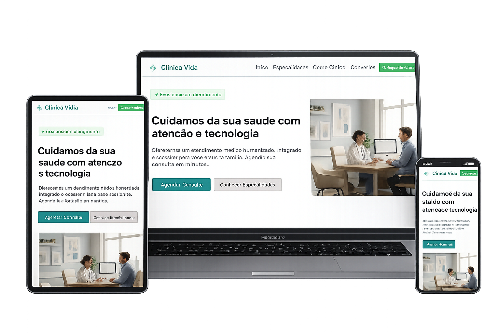

# 🏥 Clínica de Saúde - Landing Page

Landing page moderna e estratégica desenvolvida para clínicas e consultórios que desejam aumentar sua presença digital, melhorar a experiência do paciente e gerar mais agendamentos online.

---

## 📌 Visão Geral

Este projeto consiste em um site institucional para uma clínica de saúde, com foco em:

- Transmitir confiança e profissionalismo
- Facilitar o agendamento de consultas
- Apresentar serviços médicos de forma clara
- Melhorar a conversão de visitantes em pacientes

A interface foi projetada para ser limpa, acessível e orientada à ação.

---

## 🚀 Tecnologias Utilizadas

- HTML5 → Estrutura semântica e otimizada
- CSS3 → Layout responsivo e design moderno
- JavaScript → Interações e dinamismo

---

## 🎯 Objetivos do Projeto

- Gerar mais agendamentos online
- Melhorar a presença digital da clínica
- Oferecer navegação simples e intuitiva
- Garantir experiência consistente em todos os dispositivos

---

## 🧠 Estrutura do Projeto

📁 clinica-landing-page
 
 ├── 📁 assets
  
 │   ├── 📁 images
  
 │   └── 📁 icons
  
 ├── index.html
  
 ├── style.css
  
 └── script.js

---

## 📱 Responsividade

Desenvolvido com adaptação completa para:

- Smartphones
- Tablets
- Desktops

## ⚙️ Funcionalidades

- Menu responsivo (mobile e desktop)
- Navegação suave entre seções
- Botão de agendamento rápido (WhatsApp ou formulário)
- Seções estratégicas:
    - Apresentação da clínica
    - Especialidades médicas
    - Corpo clínico
    - Localização e convênios
- Call-to-actions otimizados para conversão
- Estrutura básica de SEO

---

## 📸 Preview do Projeto

---

## 🔗 Deploy

A aplicação pode ser acessada em:

https://clinica-saude-demo.netlify.app/

---

## 📈 Estratégia de Conversão

Este projeto foi estruturado com foco em resultados:

- Headlines claras e orientadas a benefício
- Uso de prova social (ex: excelência no atendimento)
- CTAs visíveis e distribuídos ao longo da página
- Redução de fricção no agendamento
- Design limpo para aumentar confiança

---

## 💼 Aplicação Comercial

Este modelo pode ser utilizado por:

- Clínicas médicas
- Consultórios particulares
- Clínicas multidisciplinares
- Profissionais da saúde autônomos

---

## 🔧 Possíveis Melhorias Futuras

- Integração com sistema de agendamento online
- Formulário com backend (envio automático de dados)
- Integração com CRM ou prontuário eletrônico
- Otimização avançada de SEO
- Implementação de blog para conteúdo médico

---

## 👨‍💻 Autor

Desenvolvido por DevForge

Portfólio: https://devforgeweb.netlify.app/
Contato: https://wa.me/5585997013067
>>>>>>> ad429a6 (Foi adicionado o arquivo README.me e alterações no endereço das imagens do projeto)
